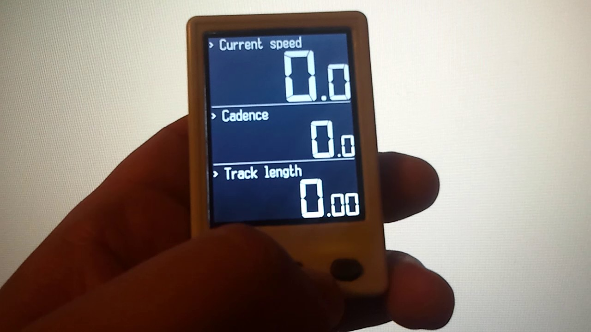
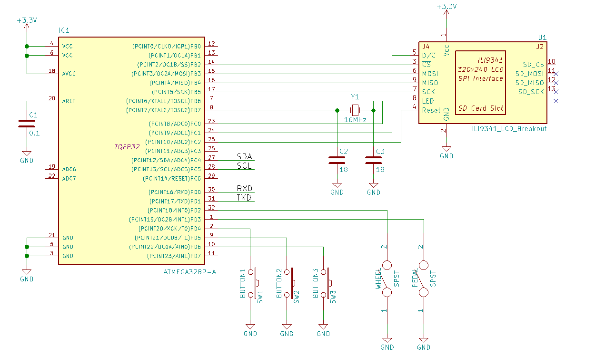

# BikeComp

This project is a simple bike computer. It measures such parameters as speed
(current and average), cadence, track time, etc. The information is displayed
on color LCD based on ILI9431 driver

## Main features:

* Automatic sleep mode
* Automatic wakeup on signal from sensors
* Speed, cadence, time measurement
* Color themes: white on black mode, black on white mode, color mode

## How it works

There are two magnets attached to the wheel and pedal. When wheel/pedal rotates, it goes near a sensor, which is the reed switch. The signals from these two (wheel and pedal) sensors goes to MCU which calculates all parameters.

## Building the code

GNU AVR Embedded Toolchain is required to build the project.

The project build system is based on [GNU Make](https://www.gnu.org/software/make/).
Linux users must have it already installed or they can easily do it.
For Windows users there is a port exists.
In both cases, both toolchain and make binaries should be added to the system PATH.

The process of building is very simple and doesn't depend on any other software installed.

`make`

## Schematic

## Useful links:

* [Article about the project](http://radiokot.ru/circuit/digital/measure/153) (in Russian)
* [Forum thread](http://radiokot.ru/forum/viewtopic.php?t=146831) (in Russian)
